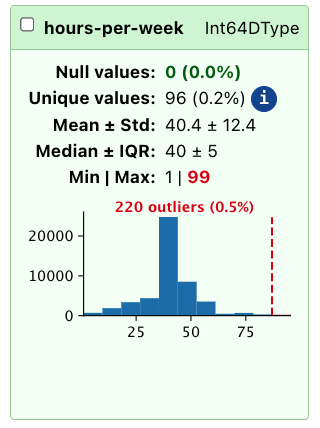

## Introduction
In this chapter, we will show how we use the skrub `TableReport` to explore
tabular data. We will use the Adult Census dataset as our example table, and 
perform some exploratory analysis to learn about the characteristics of the data. 

First, let's load the dataset.

```{python}
import pandas as pd
# Load the Adult Census dataset
data =  pd.read_csv("../data/adult_census/data.csv")
target =  pd.read_csv("../data/adult_census/target.csv")
```

Now that we have a dataframe we can work with, here is a list of features of the 
data we would like to find out:

- The size of the dataset. 
- The data types and names of the columns. 
- The distribution of values in the columns. 
- Whether missing values are present, in what measure and where. 
- Which features are discrete/categorical, and their cardinality.
- Which columns are strongly correlated with each other. 

## Exploring data with Pandas tools
Let's first explore the data using Pandas only.

We can get an idea of the content of the table by printing the first few lines, 
which gives an idea of the datatypes and the columns we are dealing with. 

```{python}
data.head(5)
```

If we want to have a simpler view of the datatypes in the dataframe, we must 
use `data.info()`:

```{python}
data.info()
```

With `.info()` we can find out the shape of the dataframe (the number of rows 
and columns), the datatype and the number of non-null values for each column. 

We can also get a richer summary of the data with the `.describe()` method:

```{python}
data.describe(include="all")
```

This gives us useful information about all the features in the dataset. Among 
others, we can find the number of unique values in each column, various statistics
for the numerical columns and the number of null values.

## Exploring data with the `TableReport`
Now, let's create a TableReport to explore the dataset.
```{python}
from skrub import TableReport
TableReport(data, verbose=0)
```


::: {.callout-tip}

If you're working from a python console rather than a Jupyter notebook (or 
equivalent), the `TableReport` must be opened explicitly:
```python
TableReport(data).open()
```

:::


### Default view of the TableReport
The `TableReport` gives us a comprehensive overview of the dataset. The default
view shows all the columns in the dataset, and allows to select and copy the content
of the cells shown in the preview. 

The `TableReport` is intended to show a preview of the data, so it does not 
contain all the rows in the dataset, rather it shows only the first and last
few rows by default. Similarly, it stores only the top 10 most frequent values
for each column, if column distributions are plotted.

### The "Stats" tab

```{python}
TableReport(data, open_tab="stats")
```

The "Stats" tab provides a variety of descriptive statistics for each column in
the dataset.
This includes:

- The column name
- The detected data type of the column
- Whether the column is sorted or not 
- The number of null values in the column, as well as the percentage
- The number of unique values in the column

For numerical columns, additional statistics are provided:

- Mean
- Standard deviation
- Minimum and maximum values
- Median

Stat columns can also be sorted, for example to quickly identify which columns 
contain the most nulls, or have the largest cardinality (number of unique values).


::: {.callout}
### Filters
Pre-made column filters are also available, allowing to select columns by dtype 
or other characteristics. Filters are shared across tabs. 
:::

### The "Distributions" tab
```{python}
TableReport(data, open_tab="distributions")
```

The "Distributions" tab provides visualizations of the distributions of values 
in each column. This includes histograms for numerical columns and bar plots for
categorical columns.

The "Distributions" tab helps with detecting potential issues in the data, such as:

- Skewed distributions
- Outliers
- Unexpected value frequencies

For example, in this dataset we can see that some columns are heavily 
skewed, such as "workclass", "race", and "native-country": this is important 
information to keep track of, because these columns may require special handling
during data preprocessing or modeling.

Additionally, the "Distributions" tab allows to select columns manually, so that
they can be added to a script and selected for further analysis or modeling.

::: {.callout-caution}
#### Outlier detection
The `TableReport` detects outliers using a simple interquartile test, marking 
as outliers all values that are beyond the IQR. This is a simple heuristic, and 
should not be treated as perfect. If your problem requires reliable outlier 
detection, you should not rely exclusively on what the `TableReport` shows. 
:::



### The "Associations" tab

```{python}
TableReport(data, open_tab="associations")
```

The "Associations" tab provides insights into the relationships between different
columns in the dataset.
It shows [Pearson's correlation](https://en.wikipedia.org/wiki/Pearson_correlation_coefficient) 
coefficient for numerical columns, as well as 
[Cramér's V](https://en.wikipedia.org/wiki/Cram%C3%A9r%27s_V) for all columns. 

While this is a somewhat rough measure of association, it can help identify potential
relationships worth exploring further during the analysis, and highlights 
highly correlated columns: depending on the modeling technique used, these may need 
to be handled specially to avoid issues with multicollinearity.

In this example, we can see that "education-num" and "education" have perfect 
correlation, which means that one of the two columns can be dropped without losing
information.


## Exploring the target variable
Besides dataframes, the `TableReport` handles series and mono- and bi-dimensional 
numpy arrays.

So, let's take a closer look at the target variable, which indicates whether an
individual's income exceeds $50K per year. We can create a separate `TableReport`
for the target variable to explore its distribution: 

```{python}
TableReport(target)
```

## Working with big tables


Plotting and measuring the column correlations are expensive operations and may
take a long time, so when the dataframe under study is large it may be more
convenient to skip them for quicker development. 

By default, both operations are skipped when a table contains more than 30 columns, 
and this threshold can be changed with the skrub config parameters 
`table_report_plots_threshold` and `table_report_plots_associations_threshold`. 

Alternatively, it is possible to set the behavior for a single report by changing
the `plot_distributions` and `compute_associations` parameters to either `True`
(to always execute the operation regardless of column number) or `False` (to 
disable entirely the feature). 

If plotting or associations are disabled, an informative message is shown:

```{python}
TableReport(
    data, compute_associations=False, plot_distributions=False, open_tab="distributions"
)
```

More detail on the skrub configuration is reported in the 
[User Guide](https://skrub-data.org/dev/modules/configuration_and_utils/customizing_configuration.html).

## Exporting the `TableReport` 
The `TableReport` can be saved on disk as an HTML. 
```{.python}
TableReport(data).write_html("report.html")
```
Then, the report can be opened using any internet browser, with no need to run 
a Jupyter notebok or a python interactive console. 

The report can also be exported in JSON format, so that it can be forwarded to 
other programs that may benefit from the TableReport artifacts and statistics. 

```python
json_str = TableReport(data).json()

with open("report.json", "w") as fp:
    fp.write(json_str)
```


::: {callout-important}

The JSON exported by the report will contain all the distribution plots in SVG 
format, which may not be necessary for some applications. To avoid exporting the
plots, set `plot_distributions=False`. 

:::


## Replacing the default dataframe `_repr_` 
It is possible to use the `TableReport` instead of the default dataframe representation
used by Pandas and Polars with `patch_display`:

```{python}
from skrub import patch_display, unpatch_display

# replace the default pandas repr 
patch_display()
data
```

To disable, use `unpatch_display`:
```{python}
unpatch_display()
data
```


## Conclusions


In this chapter we have learned how the `TableReport` can be used to speed up 
data exploration, allowing us to find possible criticalities in the data. 

We covered:

- Creating and configuring a `TableReport` for fast, interactive data exploration
- Exploring column statistics, value distributions, and associations visually
- Detecting nulls, outliers, and highly correlated columns at a glance
- Filtering columns by type or characteristics using built-in filters
- Saving and sharing interactive reports as standalone HTML files
- Adjusting `TableReport` settings for large datasets to optimize performance

In the
next chapter, we will find out how to address some of the possible problems using 
the skrub `Cleaner`.