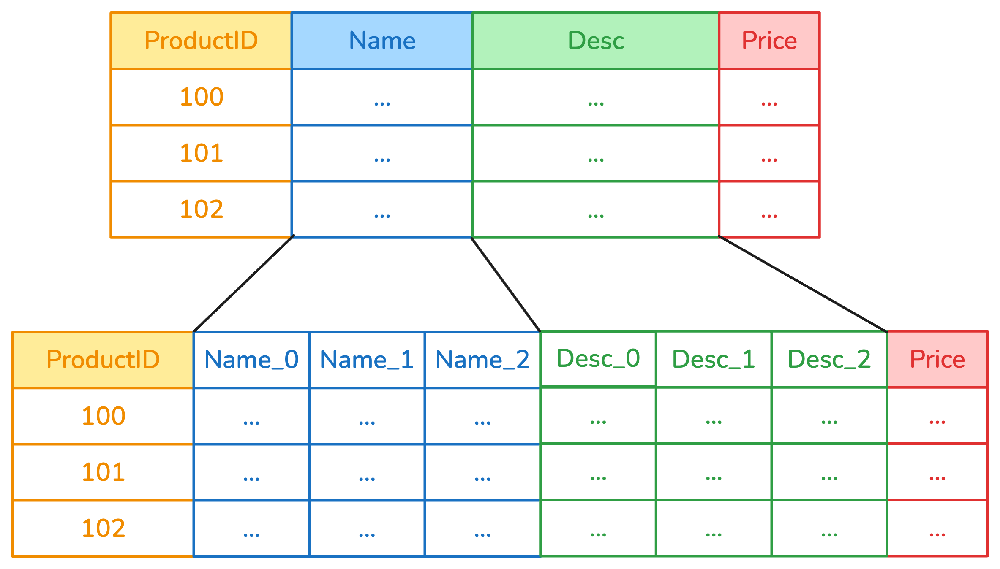
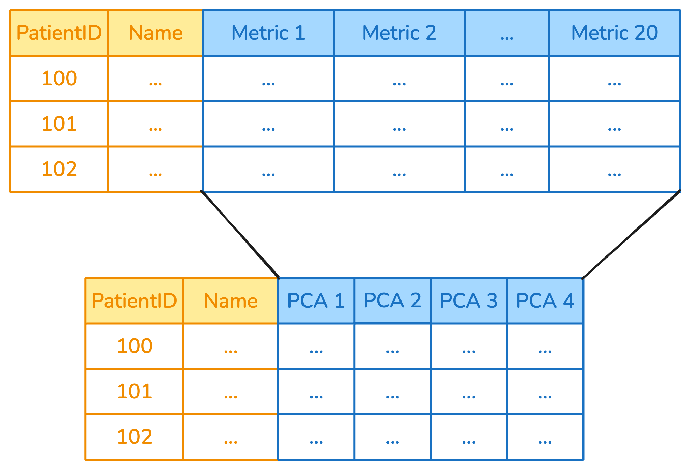

## Introduction
Often, transformers need to be applied only to a subset of columns, rather than 
the entire dataframe. 

As an example, it does not make sense to apply a `StandardScaler` to a column 
that contains strings, and indeed doing so would raise an exception. Conversely,
a `OneHotEncoder` should be appled only to categorical columns. 
Similarly, it would not make sense to try and extract time-based features (year, 
month, hour etc.) from anything but datetime columns. 

Scikit-learn provides the `ColumnTransformer` to deal with this: 

```{python}
#| echo: true
import pandas as pd
from sklearn.compose import make_column_selector as selector
from sklearn.compose import make_column_transformer
from sklearn.preprocessing import StandardScaler, OrdinalEncoder

df = pd.DataFrame({
    "user_id": [0, 1, 2],
    "date": ["03 January 2023", "04 February 2023","14 April 2023" ],
    "city": ["Paris", "London", "Rome"],
    "metric_1": [10, 20, 30],
    "metric_2": [3, 22, 45]
})

categorical_columns = selector(dtype_include=object)(df)
numerical_columns = selector(dtype_exclude=object)(df)

ct = make_column_transformer(
      (StandardScaler(),
       numerical_columns),
      (OrdinalEncoder(),
       categorical_columns))
transformed = ct.fit_transform(df)
transformed
```

`make_column_selector` allows to choose columns based on their datatype, or by 
using regex to filter column names. In some cases, this degree of control is 
not sufficient. 

To address such situations, skrub implements different transformers that allow 
to modify columns from within scikit-learn pipelines. Additionally, the selectors
API allows to implement powerful, custom-made column selection filters. 

`SelectCols` and `DropCols` are transformers that can be used as part of a 
pipeline to filter columns according to the selectors API, while `ApplyToCols` and
`ApplyToFrame` replicate the `ColumnTransformer` behavior with a different syntax
and access to the selectors. 

## Applying transformers to columns with `ApplyToCols`
Pre-processing pipelines are intended to _transform_ specific columns in specific 
ways. To make this process easier, skrub provides the `ApplyToCols` transformer. 

`ApplyToCols` applies the given transformer to a subset of columns that can be 
selected by name, or by using filters. 

In this snippet, the `OrdinalEncoder` is applied only to column `city`, which is 
selected by the parameter `cols`. 

```{python}
from skrub import ApplyToCols
import skrub.selectors as s
from sklearn.preprocessing import OrdinalEncoder

ordinal = ApplyToCols(OrdinalEncoder(), cols="city")
transformed = ordinal.fit_transform(df)
transformed
```

### Single column transformers
Depending on the transformer, the output of the transformation may need to be treated 
in particular ways. 

Most skrub transformers are designed so that they take a single column as input, 
and return a dataframe that contains one or more columns. This allows to extract
produce multiple features from a single column, for example by creating a column
for each date part in a datetime. 

In this example, columns "Name" and "Desc" have been encoded by a categorical 
encoder, so that they are represented by three components each rather than a 
single column. 


Any other transformer based on scikit-learn's design is instead designed to take 
one or multiple columns at once, and return a number of columns that depends on 
the specific transformer. A `StandardScaler` will take N columns as input, and 
return N as output, while a `PCA` would instead take N columns as input and 
return `n_components` as output, like in the following example: 



`ApplyToCols` deals with this automatically under the hood: it detects the transformer
type, then feeds it the set of columns that was selected, while passing the other
columns through unchanged. 

By passing through unselected columns without changes it is possible to chain 
several `ApplyToCols` together by putting them in a scikit-learn pipeline. 

### Excluding specific columns

It's possible to exclude one or more columns with the `exclude_cols` parameter. 
The parameter can also be combined with `cols` for finer grained control. Here,
for example, the `StandardScaler` is applied only to numeric columns whose name
is different from "user_id". 

```{python}
from sklearn.preprocessing import StandardScaler

scaler = ApplyToCols(StandardScaler(), cols=s.numeric(), exclude_cols="user_id")
scaler.fit_transform(df)
```

### Example: applying a `PCA` only to columns whose name starts with "metric"
```{python}
from skrub import ApplyToCols
from sklearn.decomposition import PCA

reduce = ApplyToCols(PCA(n_components=2), cols=s.glob("metric_*"))

df_reduced = reduce.fit_transform(df)
df_reduced.head()
```

## Concatenating the skrub column transformers
Skrub column transformers can be concatenated by using scikit-learn pipelines.
In the following example, we first select only the column `patient_id`, then encode
it using `OneHotEncoder` and finally use `PCA` to reduce the number of dimensions.

This is done by wrapping the transformers `ApplyToCols`, 
and then putting all transformers in order in a scikit-learn pipeline
using `make_pipeline`. 

```{python}
from sklearn.pipeline import make_pipeline
from sklearn.preprocessing import OneHotEncoder
from skrub import SelectCols
import numpy as np

n_patients = 5 

df = pd.DataFrame({
    "patient_id": [f"P{i:03d}" for i in range(n_patients)],
    "age": np.random.randint(18, 80, size=n_patients),
    "sex": np.random.choice(["M", "F"], size=n_patients),
})

select = SelectCols("patient_id")
encode = ApplyToCols(OneHotEncoder(sparse_output=False))
reduce = ApplyToCols(PCA(n_components=2))

transform = make_pipeline(select, encode, reduce)
dft= transform.fit_transform(df)
dft.head(5)
```

::: {.callout-important}
`ApplyToCols` is intended to work on dataframes, which are **dense**. As a result,
transformers that produce sparse outputs (like the `OneHotEncoder`) must be set 
so that their output is dense. 
:::

## Example: convert to datetime and encode

```{python}
from skrub import ToDatetime, DatetimeEncoder
from sklearn.pipeline import make_pipeline

df = pd.DataFrame({
    "date": ["03 January 2023", "04 February 2023"],
    "city": ["Paris", "London"],
    "values": [10, 20]
})

encode_datetime = make_pipeline(
    ApplyToCols(ToDatetime(), cols="date"),
    ApplyToCols(DatetimeEncoder(), cols="date"),
)
encode_datetime.fit_transform(df)
```


### The order of column transformations is important
Some care must be taken when concatenating columnn transformers, in particular
when selection is done on datatypes. Consider this case:

```{python}
encode = ApplyToCols(OneHotEncoder(sparse_output=False), cols=s.string())
scale = ApplyToCols(StandardScaler(), cols=s.numeric())
```

In the first case, we encode and then scale, in the second case we instead 
scale first and then encode. 
```{python}
transform_1 = make_pipeline(encode, scale)
dft = transform_1.fit_transform(df)
dft.head(5)
```

```{python}
transform_2 = make_pipeline(scale, encode)
dft = transform_2.fit_transform(df)
dft.head(5)
```

The result of `transform_1` is that the features that have been generated by 
the `OneHotEncoder` are then scaled by the `StandardScaler`, because the new 
features are numeric and are therefore selected in the next step. 

In many cases, this behavior is not desired: while some model types may not be 
affected by the different ordering (such as tree-based models), linear models
and NN-based models may produce worse results.

### The `allow_reject` parameter
When `ApplyToCols` is using a skrub transformer, it can use
the `allow_reject` parameter for more flexibility. By setting `allow_reject` to 
`True`, columns that cannot be treated by the current transformer will be ignored
rather than raising an exception. 

Consider this example. By default, `ToDatetime` raises a `RejectColumn` exception
when it finds a column it cannot convert to datetime. 

```{python}
from skrub import ToDatetime
df = pd.DataFrame({
    "date": ["03 January 2023", "04 February 2023", "05 March 2023"],
    "values": [10, 20, 30]
})
df
```

```{python}
#| error: true
from skrub import ApplyToCols, ToDatetime

with_reject = ApplyToCols(ToDatetime(), allow_reject=False)
result = with_reject.fit_transform(df)
```

By setting `allow_reject=True`, the datetime column is converted properly and 
the other column is passed through without issues. 
```{python}
with_reject = ApplyToCols(ToDatetime(), allow_reject=True)
with_reject.fit_transform(df)
```

## Selection operations in a scikit-learn pipeline
`SelectCols` and `DropCols` allow selecting or removing specific columns in a 
dataframe according to user-provided rules. For example, to remove columns that 
include null values, or to select only columns that have a specific dtype. 

`SelectCols` and `DropCols` take a `cols` parameter to choose which columns to 
select or drop respectively.

```{python}
from skrub import ToDatetime
df = pd.DataFrame({
    "date": ["03 January 2023", "04 February 2023", "05 March 2023"],
    "values": [10, 20, 30]
})
df
```

We can selectively choose or drop columns based on names, or more complex rules 
(see the next chapter).
```{python}
from skrub import SelectCols
SelectCols("date").fit_transform(df)
```

```{python}
from skrub import DropCols
DropCols("date").fit_transform(df)
```

## What we have seen in this chapter

In this chapter we covered how skrub can simplify applying transformers to a subset
of columns by using `ApplyToCols`. This can be done by leveraging the `cols` 
and `exclude_cols` parameters. 
We also saw how to combine and concatenate transformers by making use of the 
fact that unselected columns are passed through without changes. 
`allow_reject` lets the transformers "reject" columns they cannot deal with, 
rather than raising exceptions.
Finally, we looked into how `SelectCols` and `DropCols` can be used to select
or drop columns based on conditions. 

In the next chapter we will look into more advanced column selection methods and 
how they can be combined with the meta-transformers we have explained here. 