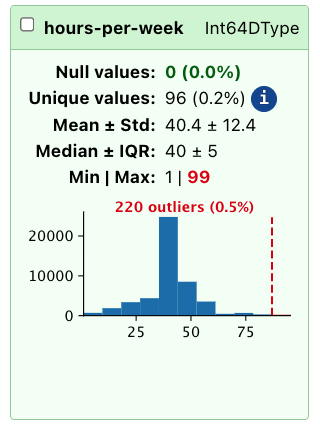

## Why do we need to explore data? {.smaller}
Before any kind of data processing or usage, we need to know what we are dealing with. 

- How big is the dataframe?
- What kind of data types are we dealing with? Only numeric, mixed types? 
- How are values distrbuted in each column? 
- Missing values: are there any? How many? Where?
- Which features are discrete/categorical, and how many categories there are.
- Are there correlated columns?

## Loading the data
```{python}
import pandas as pd
# Load the Adult Census dataset
data =  pd.read_csv("../data/adult_census/data.csv")
target =  pd.read_csv("../data/adult_census/target.csv")
```

## Exploring data with Pandas tools 1/3 {auto-animate="true" .smaller}
Let's first explore the data using Pandas only.

```{python}
data.head(5)
```

## Exploring data with Pandas tools 2/3 {auto-animate="true" .smaller}
If we want to have a simpler view of the datatypes in the dataframe, we must 
use `data.info()`:

```{python}
data.info()
```

## Exploring data with Pandas tools 3/3 {auto-animate="true" .smaller}
We can also get a richer summary of the data with the `.describe()` method:

```{python}
data.describe(include="all")
```

## Exploring data with the `TableReport` {.smaller}
The `TableReport` computes various statistics about the given dataframe and presents
them in an interactive format:

```{.python}
from skrub import TableReport
TableReport(data)
```

```{python}
#| echo: false
from skrub import TableReport
```


[Ref](../adult_census.html)

## The Preview tab
The `TableReport` shows all the columns in the dataset, and allows to select and copy the content
of the cells shown in the preview. 

As this is a preview, only the first and last few rows are displayed. 

## The Stats tab 
The `Stats` tab includes information about each column:

- full name
- detected dtype (no parsing!)
- presence of nulls
- cardinality (number of unique values)
- additional statistics for numerical features

## The Distributions tab
A histogram is drawn for each column to show the distribution of values in that 
column. 

Most frequent values are also displayed

## The Associations tab
Cramer's V and Pearson's correlation coefficient are measured for all pairs of 
columns.

Associations show whether there are strong correlations between columns, and 
columns that may be redundant. 


## Outlier detection

::: {.columns}

::: {.column}

The `TableReport` detects outliers using a simple interquartile test, marking 
as outliers all values that are beyond the IQR. This is a simple heuristic, and 
should not be treated as perfect. If your problem requires reliable outlier 
detection, you should not rely exclusively on what the `TableReport` shows. 

:::

::: {.column}



:::

:::

## Filtering the displayed columns
It is possible to filter columns with pre-made filters, or define custom filters:

```{python}
my_filter = {"only_education": ["education", "education-num"]}

TableReport(data, column_filters=my_filter)
```

Skrub selectors can be used for that (more on that later).

## Exploring the target variable {.smaller}
Besides dataframes, the `TableReport` handles series and mono- and bi-dimensional 
numpy arrays.

```{python}
TableReport(target)
```

## Working with big tables
Plot generation and computation of associations are very expensive operations, so
so they can be disabled for big tables.

Use the `plot_distributions` and `compute_associations` parameters to do so: 

```{python}
TableReport(
    data, plot_distributions=False, compute_associations=False, open_tab="distributions"
)
```

## Exporting the `TableReport`

The `TableReport` computes many statistics about a given table. Typically, the 
interactive view is sufficient when developing with a notebook. 

It is also possible to export the statistics in various formats to share them,
or to use them programmatically. 

## Exporting the `TableReport`: HTML
The `TableReport` can be saved on disk as an HTML. 
```{.python}
TableReport(data).write_html("report.html")
```

::: {.callout-tip}
The report can be opened using any internet browser, with no need to run 
a Jupyter notebok or a python interactive console. 
:::

## Exporting the `TableReport`: JSON
It is possible to export the report in JSON format:

```{.python}
json_str = TableReport(data).json()
```

::: {.callout-important}

The JSON report contains everything needed to rebuild a report, including plots. 
If the plots are not needed, disable them with `plot_distributions=False`. 

:::

## Exporting the `TableReport`: Markdown {.smaller}
The report can be exported in summarized form as a Markdown-formatted string:

```python
md_str = TableReport(data).markdown()

with open("report.md", "w") as fp:
    fp.write(md_str)
```

::: {.callout-warning}

The `TableReport` does not do any sanitization of the input data, and prints out
column names and most frequent values as part of the output. Do not feed the content
of the report to an agent if the dataset is large, or if its content is not trusted.

:::

## Exporting the `TableReport`: python dict {.smaller}
The report can also be exported as a python dict to use the statistics it measures
in a python script:

```python
tr_dict = TableReport(data, plot_distributions=False).dict()
```

## What we have seen in this chapter {.smaller}

- Creating and configuring a `TableReport` for fast, interactive data exploration
- Exploring column statistics, value distributions, and associations visually
- Detecting nulls, outliers, and highly correlated columns at a glance
- Filtering columns by type or characteristics using built-in filters
- Adjusting `TableReport` settings for large datasets to optimize performance
- Saving and exporting reports as HTML, JSON, Markdown and python dicts