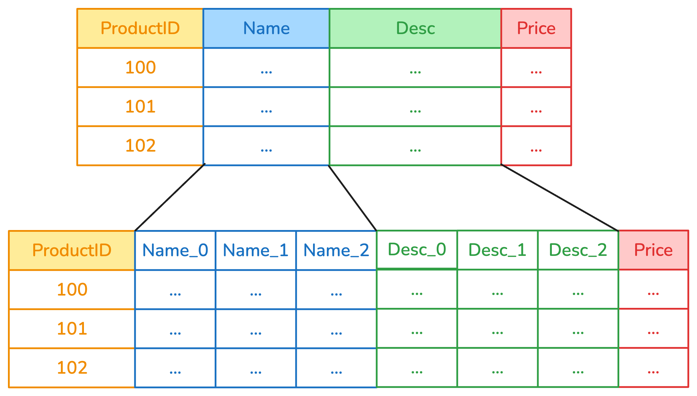
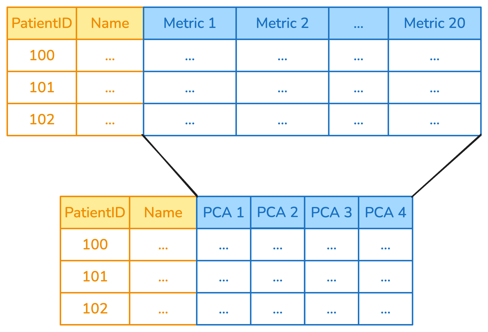

## Why Column-Specific Transformations?
Different columns must be handled in different ways. 

```{python}
import pandas as pd

df = pd.DataFrame({
    "user_id": [0, 1, 2],
    "date": ["03 January 2023", "04 February 2023","14 April 2023" ],
    "city": ["Paris", "London", "Rome"],
    "metric_1": [10.3, 20.7, 30.8],
    "metric_2": [3.5, 22.3, 45.1]
})

```

## Why Column-Specific Transformations? {.smaller}


::: {.incremental}
- Some transformers (e.g., the `StandardScaler`) work only on numeric columns
- Some transformers (e.g., the `OneHotEncoder`) work only on categorical columns
- Different columns with the same dtype may need to be treated differently (e.g.,
an integer ID should not be scaled)
- Some transformations only make sense for a subset of the columns (e.g., extracting
the year from datetimes)
:::


## Applying transformers to columns with `ApplyToCols` {.smaller}
`ApplyToCols` is a **meta-transformer**: it applies a transformer to selected columns.

Columns that are not selected pass through without changes.

```{python}
from skrub import ApplyToCols
from sklearn.preprocessing import OrdinalEncoder

ordinal = ApplyToCols(OrdinalEncoder(), cols="city")
transformed = ordinal.fit_transform(df)
transformed
```

## Example: `ApplyToCols` to encode
`ApplyToCols(OneHotEncoder(), cols=["Name", "Desc"])`



## Example: `ApplyToCols` to decompose
`ApplyToCols(PCA(), cols=s.glob("metric_*"))`



## Exclude specific columns {.smaller}

::: {.callout-note}

Apply the `StandardScaler` only to the `metric_*` columns, excluding
the column `user_id`.

:::

```{python}
import skrub.selectors as s
from sklearn.preprocessing import StandardScaler

scaler = ApplyToCols(StandardScaler(), cols=s.numeric(), exclude_cols="user_id")
scaler.fit_transform(df)
```

## Chaining Transformers {.smaller}

Use a scikit-learn `Pipeline` to concatenate multiple transformers, when
wrapped in `ApplyToCols`:

```{.python}
from sklearn.pipeline import make_pipeline
from sklearn.preprocessing import OneHotEncoder

select = SelectCols("department-name")
encode = ApplyToCols(OneHotEncoder(sparse_output=False))
reduce = ApplyToCols(PCA(n_components=2))

transform = make_pipeline(select, encode, reduce)
```


::: {.callout-tip}

Remember that columns that are not selected **pass through** without any change. 

:::

## Example: convert to datetime and encode

```{python}
from skrub import ToDatetime, DatetimeEncoder
from sklearn.pipeline import make_pipeline

df = pd.DataFrame({
    "date": ["03 January 2023", "04 February 2023"],
    "city": ["Paris", "London"],
    "values": [10, 20]
})
encode_datetime = make_pipeline(
    ApplyToCols(ToDatetime(), cols="date"),
    ApplyToCols(DatetimeEncoder(), cols="date"),
)
encode_datetime.fit_transform(df)
```


## Order Matters! {.smaller}

Transformers should be ordered carefully:

```{.python}
# Encode first, then scale
transform_1 = make_pipeline(
    ApplyToCols(OneHotEncoder(sparse_output=False), cols=s.string()),
    # Strings are now numbers! 
    ApplyToCols(StandardScaler(), cols=s.numeric())
)

# vs. Scale first, then encode
transform_2 = make_pipeline(
    ApplyToCols(StandardScaler(), cols=s.numeric()),
    # Strings haven't been touched
    ApplyToCols(OneHotEncoder(sparse_output=False), cols=s.string())
)
```


::: {.callout-tip}

This is particularly important if you use expensive models to generate features! 

:::

## Handling columns that can't be transformed

- It is not always possible to know a priori if a transformer can handle a column. 
- The default behavior is to **reject columns** that can't be handled. 
- In some situations, it is expected that some columns will be rejected (e.g., 
if the transformer needs to detect the column dtype)

## Handling columns that can't be transformed

When `allow_reject=True`, columns that can't be transformed are passed through:

```{python}
from skrub import ApplyToCols, ToDatetime

with_reject = ApplyToCols(ToDatetime(), allow_reject=True)
result = with_reject.fit_transform(df)
```

## Define custom transformers to use with `ApplyToCols`
- Some columns need specific transformations
- You can define your transformer and have it work seamlessly with `ApplyToCols`

```python
from skrub.core import RejectColumn, SingleColumnTransformer
class CustomTransformer(SingleColumnTransformer):
    def __init__(self):
        return
    def fit_transform(self, X, y=None):
        ... do something

        if ... # the column can't be handled
            raise RejectColumn(...)
        return transformed
```


## What we have seen in this chapter

- `ApplyToCols`: Apply a transformer to columns selected with `cols`, exclude with
`exclude_cols`
- Chain transformers with scikit-learn pipelines
- `allow_reject`: Reject columns that cannot be treated
