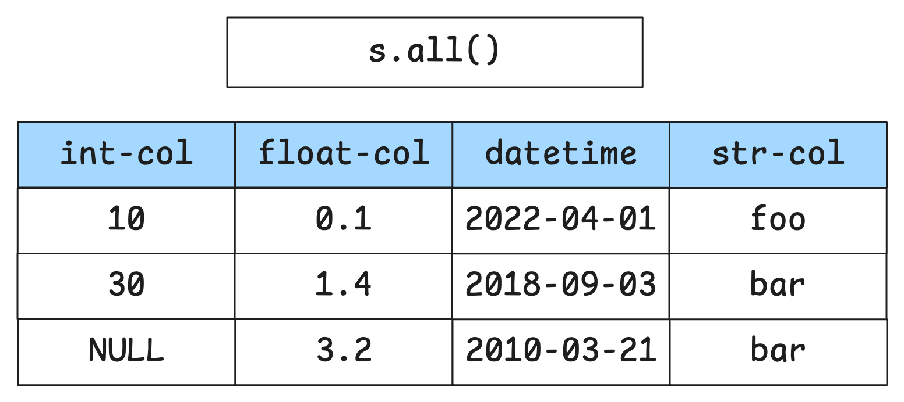
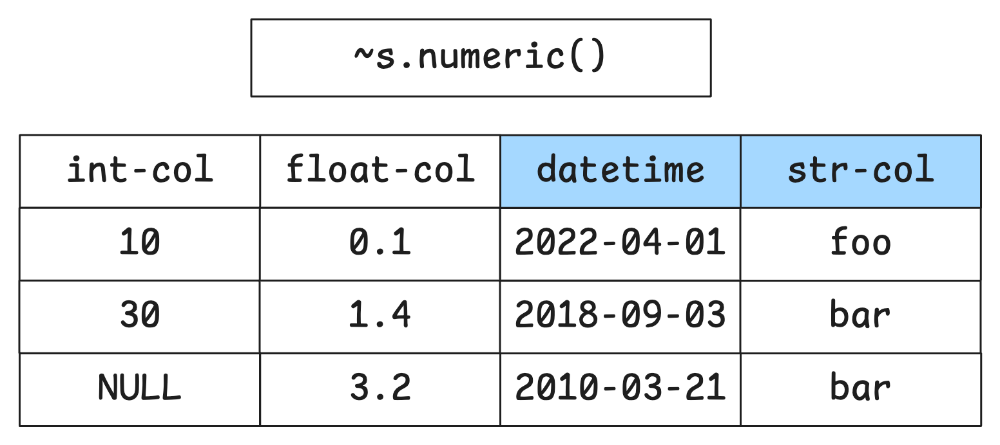
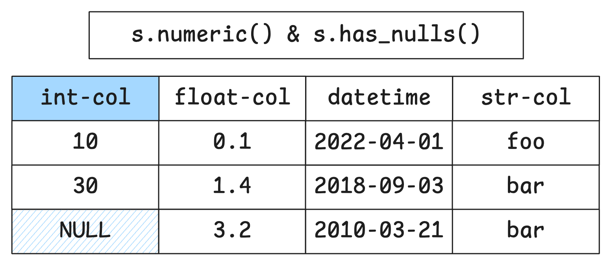
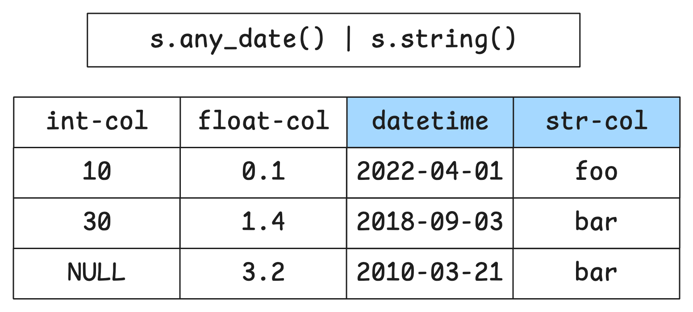

## Introduction to Selectors

Complex column selection beyond simple name lists:

```{python}
import skrub.selectors as s
```

Selectors are used throughout the skrub package:

- `ApplyToCols`
- `TableReport` filters
- `.skb.apply()`

## Example: Select String Columns {.smaller}

```{python}
import pandas as pd

df = pd.DataFrame({
    "age": [25, 30, 35],
    "name": ["Alice", None, "Charlie"],
    "city": ["NYC", "LA", "Chicago"]
})

```

::: {.columns}

::: {.column}

`s.select()` to select columns:

```{python}
s.select(df, s.string())
```

:::

::: {.column}


... and `s.drop()` to remove them:

```{python}
s.drop(df, s.string())
```

:::

:::


## Selecting by Data Type

- `.numeric()`: Numeric columns (int or float)
- `.integer()`: Integer columns only
- `.float()`: Floating-point columns
- `.string()`: String columns
- `.categorical()`: Categorical columns
- `.any_date()`: Date or datetime columns
- `.boolean()`: Boolean columns


## Selecting by Characteristics

- `.all()`: All columns
- `.has_nulls()`: Columns with more than a given threshold of nulls (default=0)
- `.cardinality_below(threshold)`: fewer than `threshold` unique values
- `.has_dtype()`: Columns that have the provided dtype

## Example: select list columns with `has_dtype`

```{python}
import polars as pl

df = pl.DataFrame({"A": [[1,2], [1,2,3]], "B": ["A", "B"]})
df.dtypes
```

```{python}
sel = s.has_dtype(pl.List)
s.select(df, sel)
```


## Selecting by Name {.smaller}


::: {.columns}

::: {.column}


- `.cols("name")`: Specific column name(s)
- `.glob("pattern*")`: Unix shell-style globbing
- `.regex("pattern")`: Regular expressions

:::

::: {.column}

```{python}
df = pd.DataFrame({
    "patient_id": [101, 102, 103],
    "metric_1": [0.3, 0.3, 0.6],
    "metric_2": [3, 5, 10],
})

s.select(df, s.glob("metric_*"))
```


:::

:::


## Combining Selectors {.smaller}

Selectors can be combined: 

- each selector produces a **set** of columns
- **set operations** (`&`, `|`, `^`, `-`, `~`) can be used
to combine selectors
- column names or lists of columns can be used directly

```{.python}
# Inverse: NOT numeric
~s.numeric()

# OR: datetime columns OR string columns OR the columns in a list
s.any_date() | s.string() | ["date", "datetime-col"]

# AND: string columns without nulls
s.string() & ~s.has_nulls()

# Exclude: all columns except "datetime-col"
s.all() - "datetime-col"

```

## Combining Selectors: `.all()` {auto-animate="true"}



## Combining Selectors: NOT {auto-animate="true"}



## Combining Selectors: AND {auto-animate="true"}



## Combining Selectors: OR {auto-animate="true"}



## Multiple aggregations in pandas with selectors{.smaller}


::: {.columns}

::: {.column}

Define a selector: only numeric columns except the "id"

```{python}
df = pd.DataFrame(
    {
        "id": [1, 2, 3, 4],
        "group": ["A", "A", "B", "B"],
        "str": ["foo", "bar", "baz", "qux"],
        "value1": [1, 2, 30, 40],
        "value2": [5, 6, 7, 8],
    }
)

# pick the numeric columns to aggregate, except the id
only_num = (s.numeric() - "id")
```

:::

::: {.column}

```{python}
aggs = {col: ["mean", "sum"] for col in only_num.expand(df)}
df.groupby("group").agg(aggs)
```

:::

:::


## Using selectors to aggregate pandas dataframes {.smaller}

New columns are handled by the selector:

```{python}
# new columns, same selector
df["value3"] = [100, 200, 300, 400]
df["note"] = ["a", "b", "c", "d"]

aggs = {col: ["mean", "sum"] for col in only_num.expand(df)}
df.groupby("group").agg(aggs)
```

## Custom Selectors: Filter by Condition {.smaller}
Define a function that takes **one column** as input and returns `True`/`False` 
as output (depending on if the column is selected or not)

```{python}
def more_nulls_than_half(col):
    return col.isnull().sum() / len(col) > 0.5

df = pd.DataFrame(
    {
        "no-nulls": [1, 2, 3, 4],
        "lotsa-nulls": [None, None, None, 4],
    }
)

selector = s.filter(more_nulls_than_half)
s.select(df, selector)
```

## Using selectors with the `TableReport` {.smaller}

The `TableReport` can use selectors (or simply column names) to focus only on 
specific columns:

```{python}
from skrub import TableReport
custom_filter = {"metrics": s.glob("metric_*")}

df = pd.DataFrame({
    "patient_id": [101, 102, 103],
    "metric_1": [0.3, 0.3, 0.6],
    "metric_2": [3, 5, 10],
})

TableReport(df, column_filters=custom_filter)
```


## What we have seen in this chapter

- Selectors can be used for flexible, reusable column selection
- Selectors can be combined with logical operators as "sets of columns"
- `expand()` extracts selected column names and can be used with 
dataframe libraries
- `s.filter()` can be used to create custom selectors for domain-specific logic
- `ApplyToCols` and `TableReport` can use selectors to filter columns
