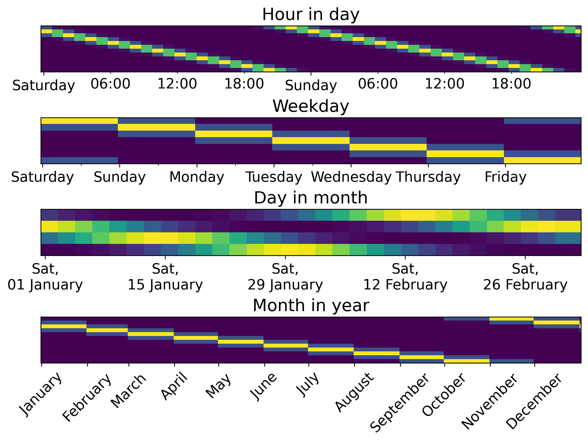

## The Datetime Challenge

Datetimes come in many formats:

- "2023-01-03" (ISO format)
- "03/01/2023" (EU format)
- "January 3, 2023" (text)
- "03 Jan 2023" (custom)

Correct parsing is essential for feature extraction.

## Converting Strings to Datetime

**`ToDatetime`**: Single column transformer with format guessing:

```{python}
from skrub import ApplyToCols, ToDatetime
import pandas as pd

df = pd.DataFrame({"dates": ["2023-01-03", "2023-02-15"]})
df_dt = ApplyToCols(ToDatetime(), allow_reject=True).fit_transform(df)
df_dt
```

**`Cleaner`**: Also parses datetimes with custom format:

```{python}
from skrub import Cleaner

cleaner = Cleaner(datetime_format="%d %B %Y")
df_clean = cleaner.fit_transform(df)
df_clean
```

## Extracting Datetime Features {.smaller}

Datetimes must be converted to numerical features:

```{python}
df_dt["year"] = df_dt["dates"].dt.year
df_dt["month"] = df_dt["dates"].dt.month
df_dt["day"] = df_dt["dates"].dt.day
df_dt["weekday"] = df_dt["dates"].dt.weekday
df_dt["day_of_year"] = df_dt["dates"].dt.day_of_year
df_dt["total_seconds"] = (df_dt["dates"] - pd.Timestamp("1970-01-01")) // pd.Timedelta('1s')
```

## Simpler with DatetimeEncoder

```{python}
from skrub import DatetimeEncoder, ApplyToCols

de = DatetimeEncoder(
    add_total_seconds=True,
    add_weekday=True,
    add_day_of_year=True
)

df_dt = ApplyToCols(ToDatetime(), allow_reject=True).fit_transform(df)
df_enc = ApplyToCols(de, cols="dates").fit_transform(df_dt)
df_enc
```

## Periodic Features

Cyclical patterns need special handling:

- Day of week: 0-6, but 0 and 6 are close
- Month: 1-12, but 12 and 1 are close
- Hour: 0-23, but 23 and 0 are close

## Circular (Sin/Cos) Encoding

```python
import numpy as np

df["weekday_sin"] = np.sin(2 * np.pi * df["weekday"] / 7)
df["weekday_cos"] = np.cos(2 * np.pi * df["weekday"] / 7)
```

Or with `DatetimeEncoder`:

```{python}
de = DatetimeEncoder(periodic_encoding="circular")
df_enc = ApplyToCols(de, cols="dates").fit_transform(df_dt)
df_enc
```

## Spline Encoding Alternative

```{python}
de = DatetimeEncoder(periodic_encoding="spline")
df_enc = ApplyToCols(de, cols="dates").fit_transform(df_dt)
df_enc
```

## Example: spline periodic features


## Key Takeaways

- Use `ToDatetime` or `Cleaner` to parse string dates
- `DatetimeEncoder` extracts useful features
- Use periodic encoding for cyclical features
- Circular encoding: sin/cos transformation
- Spline encoding: alternative periodic approach
