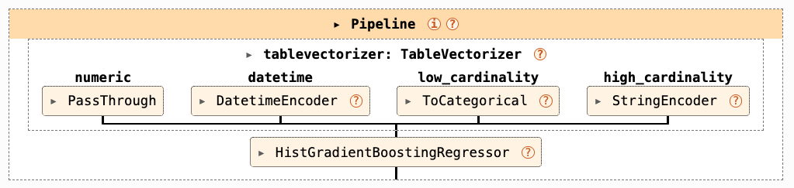
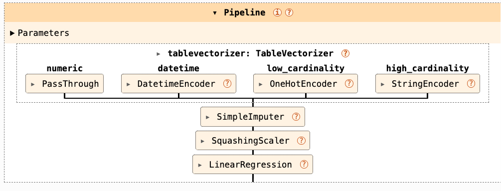
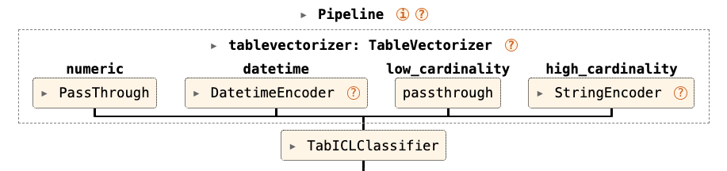

## Building a baseline model with preprocessing

Beyond preprocessing and cleaning, machine learning pipelines need to:

- Add new features via feature engineering
- Handle missing values (optional)
- Scale numeric features (also optional)
- Train the model

We also want to find out if there is a signal to learn in the data.


## Reminder: avoiding data leakage
- We want to prevent data that belongs to the test set from entering the train set.
- Data leakage leads to over-optimistic results. 
- Transformers and encoders must be trained exclusively on the training samples.
- Remember: pre-processing is part of the entire design! 

This is why we want a `Pipeline`! 

## Manual Pipeline Construction {.smaller}
scikit-learn provides either `Pipeline` or `make_pipeline` to concatenate transformers
and avoid leakage. 

The pipeline takes care of passing the same set of samples to the transformers 
in sequence. 

```{python}
from sklearn.pipeline import make_pipeline
from sklearn.linear_model import LogisticRegression
from sklearn.preprocessing import StandardScaler
from sklearn.impute import SimpleImputer
from skrub import TableVectorizer

model = make_pipeline(
    TableVectorizer(),      # Feature engineering
    SimpleImputer(),        # Handle missing values
    StandardScaler(),       # Normalize features
    LogisticRegression()    # Final estimator
)
```

## The `tabular_pipeline` Function

skrub's `tabular_pipeline` returns a pipeline that includes all steps, with 
tuned defaults depending on the input model. 

```{.python}
from skrub import tabular_pipeline
from tabicl import TabICLRegressor

# Option 1: Provide an estimator
model = tabular_pipeline(LogisticRegression())
model_tabicl = tabular_pipeline(TabICLRegressor())

# Option 2: Use preset strings
model_clf = tabular_pipeline("classification")
model_reg = tabular_pipeline("regression")
```

## What the pipeline looks like: tree-based model




## What the pipeline looks like: linear model


## What the pipeline looks like: TabICL


## Customizing the pipeline

::: {.callout-tip}
This is not necessary most of the time!
:::


::: {.fragment}

```{python}
from sklearn.decomposition import PCA
from sklearn.linear_model import Ridge
from sklearn.pipeline import make_pipeline
from skrub import tabular_pipeline
# Create a pipeline that includes two steps
model_pipeline = make_pipeline(PCA(n_components=20), Ridge())

# Pass the new model to tabular_pipeline
full_pipeline = tabular_pipeline(model_pipeline)
[name for name, _ in full_pipeline.steps]
```

:::

## Customizing the `tabular_pipeline` {.smaller}

**Use `tabular_pipeline`** if:

- You need a quick baseline for benchmarking/checking if there is a signal
- You want a starting point for experimentation
- You don't need custom preprocessing/feature engineering

**Embed a pipeline in `tabular_pipeline`** if :

- You need to modify only the end of the pipeline
```python
# Create a pipeline that includes two steps
model_pipeline = make_pipeline(PCA(n_components=20), Ridge())
# Pass the new model to tabular_pipeline
full_pipeline = tabular_pipeline(model_pipeline)
```

**Use a manual pipeline** if :

- You need fine-grained control over most of the transformations
- Your training process includes custom preprocessing steps
- You want to experiment with different transformers

Or... use the skrub Data Ops! 

## Example: Complete Workflow

```{.python}
from sklearn.model_selection import cross_val_score

# Create pipeline
model = tabular_pipeline(LogisticRegression())

# Evaluate with cross-validation
scores = cross_val_score(model, X, y, cv=5)
print(f"Score: {scores.mean():.4f}")
```

That's it! 

## What we have seen in this chapter 

- Always use pipelines to prevent data leakage
- `TableVectorizer` handles most of the feature engineering
- The `tabular_pipeline` uses good defaults based on the type of estimator used
- Pass a model (`LogisticRegression()`, `TabICLRegressor()`), or a string ("regression", 
"classification")
- Use manual pipelines to retain full control
